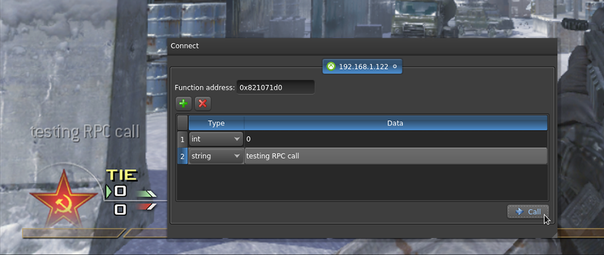

# xbrpc
An effort at a small front-end for xbrpc.

This is a work-in-progress that I work on sparingly.

**TODO**:
- Add more data types as arguments (`char`, `bool`, etc.) even though most of these can be achieved with the existent ones (due to how they're given to argument registers anyway).
- Clean up the source of `xbrpc` and merge it into this repository. 
- Add return type information (requires defining a more serious protocol).
- Potentially add length-prefixing to the protocol since right now I'm relying on fairly consistent TCP windowing sizes.
- Add support for an XBDM-based debugging channel that spews everything given to `DbbPrint` (see https://gist.github.com/obscurecolin/83cda0f6320cba468d3b469a95abaa93 - requires I print useful messages from `xbrpc`).
- Add tab closing support that actually terminates the connection (`kDisconnect`)
